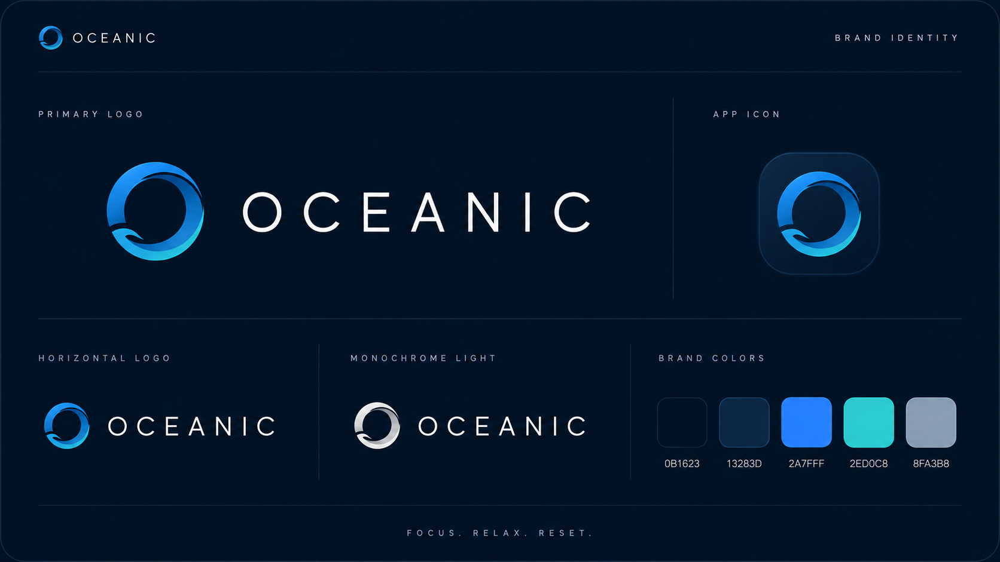
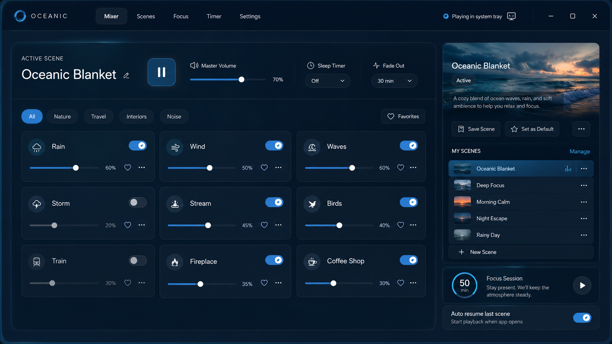
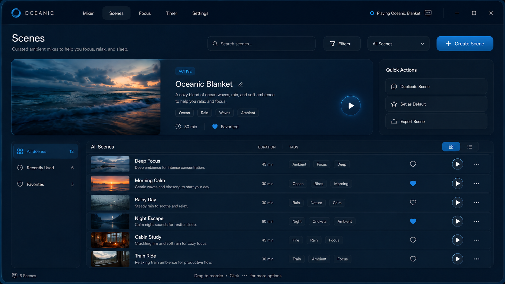
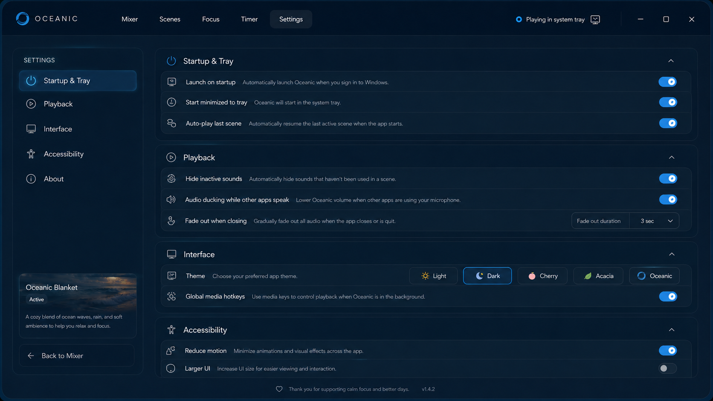
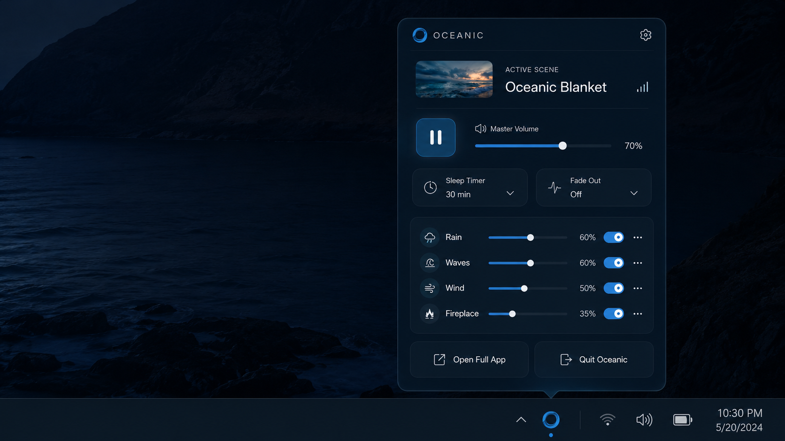

<h1 style="font-family: Arial, sans-serif; font-size: 36px; color: #5FA8F5; display: flex; align-items: center; gap: 12px; border-bottom: 3px solid #5FA8F5; padding-bottom: 8px;">
  
  Oceanic - Ambient Focus Desktop App
</h1>

Oceanic is a modern ambient sound and scene player built as a desktop app with **Tauri + React + TypeScript**.
It helps you focus, relax, and sleep with layered sound mixing, curated visual scenes, timers, fade-out controls, and tray-first playback controls.

---

## Tech Used


---

## Features

- Real-time ambient mixer with grouped sounds and per-sound volume control
- Scene library with preview, search/filter, favorites, quick actions, and fullscreen playback modal
- Sleep timer with optional fade-out over configurable duration
- Auto-play on launch and persisted local preferences
- Native system tray integration (show/hide, play/pause, quit)
- Optional launch-on-startup support
- Multiple utility pages: Mixer, Scenes, Timer, and Settings
- Custom desktop titlebar and frameless Tauri window UX

---

## Desktop Behavior

Oceanic combines frontend state with native desktop controls:

1. Playback state and preferences

- Frontend audio playback is managed in React (`src/App.tsx`) with per-sound `HTMLAudioElement` instances.
- User preferences are managed via `useOceanicPreferences` and persisted locally.

2. Tray-first workflow

- Rust backend creates tray menu actions for:
  - show window,
  - hide window,
  - play/pause all sounds,
  - quit app.
- Tray play/pause emits `oceanic://toggle-playback` which the React app listens to.

3. Close-to-tray behavior

- Closing the main window does not quit when `minimizeToTray` is enabled.
- The window hide behavior is handled in `src-tauri/src/lib.rs` (`WindowEvent::CloseRequested`).

4. Startup behavior

- Launch-on-startup is handled with `@tauri-apps/plugin-autostart`.
- If launched with autostart arg and `startMinimized` is enabled, the window starts hidden.

---

## Screenshots



**Mixer:** Live ambient controls, categories, master volume, sleep timer, and fade out.

---



**Scenes:** Browse and play curated visual scenes with quick actions.

---



**Settings:** Startup, playback, interface, and accessibility preferences.

---



**Navigation:** Desktop-style top bar and routed pages.

---

## Project Structure

```plaintext
src/
|-- components/             # Shared UI components (titlebar, scene player, cached video)
|-- hooks/                  # Preferences/state hooks
|-- lib/                    # Sounds, scenes, themes, types, video cache helpers
|-- pages/                  # Mixer, Scenes, Timer, Settings pages
|-- App.tsx                 # App shell + routing + audio lifecycle
|-- main.tsx                # React entry point
`-- index.css               # Tailwind + app styling

src-tauri/
|-- src/
|   |-- lib.rs              # Tray, window lifecycle, native commands
|   `-- main.rs             # Tauri bootstrap
|-- tauri.conf.json         # Window/build/bundle config
`-- Cargo.toml              # Rust dependencies and crate config
```

---

## Getting Started

### 1. Prerequisites

- Node.js 18+
- pnpm
- Rust toolchain
- Tauri system dependencies for your OS

### 2. Install dependencies

```bash
pnpm install
```

### 3. Run frontend only (browser)

```bash
pnpm dev
```

Open:

```text
http://localhost:1420
```

### 4. Run desktop app (Tauri)

```bash
pnpm tauri dev
```

---

## Available Scripts

```bash
pnpm dev        # Start Vite dev server
pnpm build      # Type-check and build frontend assets
pnpm preview    # Preview built frontend assets
pnpm tauri dev  # Run desktop app in development
pnpm tauri build # Build desktop installers/bundles
```

---

## Core Pages

- `/` -> Mixer (ambient controls)
- `/scenes` -> Scene browser and player launcher
- `/timer` -> Focus timer workspace
- `/settings` -> App configuration panels

---

## Media Notes

- Scene thumbnails now use `.avif`.
- Scene videos are encoded to `.mp4` (`libx264`, `CRF 28`) for app usage.
- Source media lives under `public/images/scenes` and `public/videos`.

---

## Credits

Built by the Oceanic project team.
